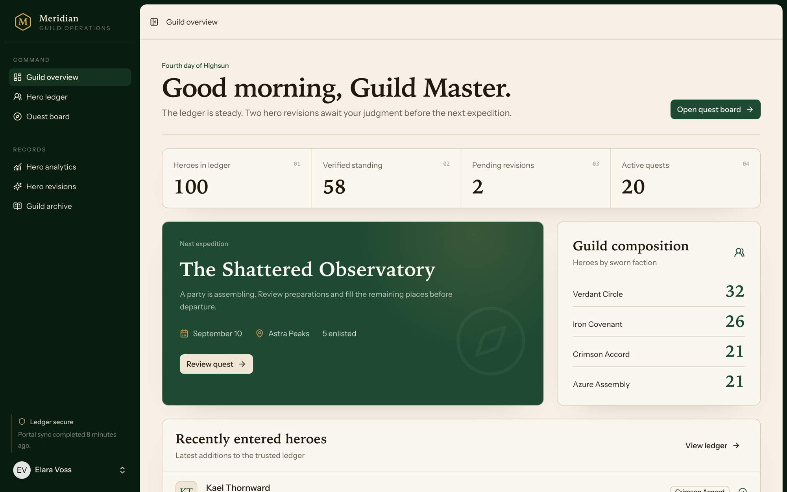

# Meridian

Meridian is an operations portal for a fictional adventurers' guild. Guild masters keep a ledger of heroes, put quests on the board, and check heroes in at the site by entering their rune code. The fantasy is only the vocabulary. The problems underneath are the ones I deal with in member and event systems at work: a directory people trust, changes that get reviewed before they land, check-in that works on a phone, and seed data that is safe to run twice.



## Run it

You need PHP 8.4, Composer, and Node 22.

```bash
composer run setup
php artisan db:seed
composer run dev
```

Sign in at http://localhost:8000 with `guildmaster@meridian.test` and `password`. It runs on SQLite so there is nothing else to install. The seed fills the guild with 100 heroes and a season of quests and can be run again without doubling anything.

## What's built

- **Guild overview.** Hero and quest counts, the next expedition, guild composition by faction, and the latest heroes entered.
- **Hero ledger.** Every hero with their standing, faction, and field history. Search by name, code, or calling, and add a hero from the ledger.
- **Hero analytics.** Total heroes, verified coverage, who has been active in the last 90 days, and quest participation.
- **Quest board and muster.** Quests with a difficulty, party limit, requirements, and enlistments. At the site a guildkeeper enters a hero's rune code and the hero is marked present or departed. A hero who never enlisted gets a walk-in enlistment instead of an error.
- **Hero revisions and guild archive.** Both are pages today. The review queue lists submitted changes but approval is not wired up yet. See the specs for where they are headed.
- **Auth.** Fortify with two factor, passkeys, and email verification.

## How it's built

Laravel 13 with Inertia v3 and React 19, Tailwind 4 and shadcn/ui for the interface, Wayfinder for typed routes, and Pest for tests. SQLite in development and in the test suite. It deploys as a container behind Coolify.

`composer run ci:check` runs Pint, PHPStan, ESLint, Prettier, tsc, and the test suite. GitHub Actions runs the same checks on every push and pull request.

## Specs

I wrote the specs before the code. `docs/specs/constitution.md` has the principles every spec assumes, and each numbered folder covers one feature, with a design doc where the data model or state transitions needed one. Not everything in them is built yet. The player portal API, guild master and scout roles, revision approval, and ledger export and restore are still spec only.

| Spec | Covers |
|---|---|
| [constitution](docs/specs/constitution.md) | Product and engineering principles |
| [00 product vision](docs/specs/00-product-vision/spec.md) | Positioning, personas, scope, and success |
| [01 tech foundation](docs/specs/01-tech-foundation/spec.md) | Laravel, Inertia, React, and repository conventions |
| [02 auth and roles](docs/specs/02-auth-roles/spec.md) | Guild master and scout roles and access control |
| [03 heroes](docs/specs/03-heroes/spec.md) | Hero ledger, verification, revisions, factions, and runes |
| [04 quests](docs/specs/04-quests/spec.md) | Quests, enlistments, wanderers, and live muster |
| [05 player portal api](docs/specs/05-player-portal-api/spec.md) | Idempotent player portal integration |
| [06 dashboard](docs/specs/06-dashboard/spec.md) | Guild health, growth, and next quest overview |
| [07 data import and export](docs/specs/07-data-import-export/spec.md) | Bulk export, restore, and reset |
| [08 frontend ux](docs/specs/08-frontend-ux/spec.md) | The visual system and interaction conventions |

## Vocabulary

| Meridian | Plain version |
|---|---|
| Hero ledger | Member directory |
| Hero code | Stable external id |
| Guild standing | Eligibility status |
| Faction | Chapter or team |
| Quest | Event |
| Enlistment | Registration |
| Wanderer | Unmatched guest |
| Muster | Check-in and check-out |
| Hero revision | Reviewed data change |
| Player portal | External self-service app |

MIT licensed.
